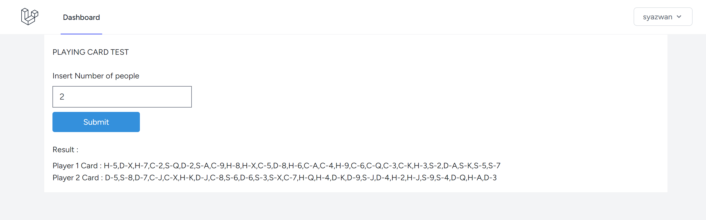
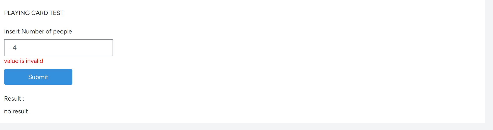

Programming Test

Theme: Playing cards will be given out to n(number) people

Purpose: Total 52 cards containing 1-13 of each Spade(S), Heart(H), Diamond(D), Club(C) will be
given to n people randomly.

Language : Php 8.2.4
Framework : Laravel 10.17.1

ui and javascript code : resource/view/dashboard.blade
backend code : app/http/coontroller/ProcessController.php

sample image

